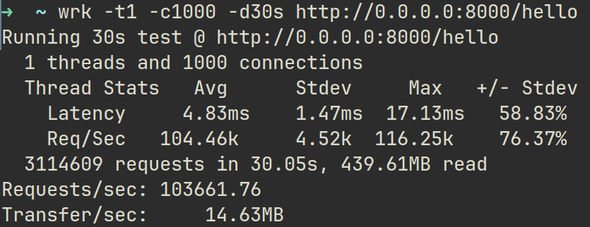
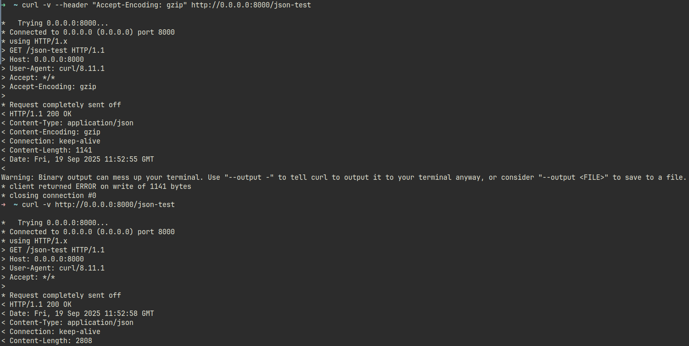

# Benchmarks

### Simple get request  

- **Tool**: wrk 4.2.0
- **Command**: `wrk -t1 -c1000 -d30s http://localhost:8000/hello`
- **Environment & Hardware**: Ryzen 7 5700x, 32GB RAM, Fedora 42, Go 1.21
- **Results**:
  - Requests/sec: 103,661
  - Average Latency: <5ms
  - Concurrent Connections: 1,000

---

### Gzip compression

- **Environment & Hardware**: Ryzen 7 5700x, 32GB RAM, Fedora 42, Go 1.21
- **Command**: `curl -v --header "Accept-Encoding: gzip" http://0.0.0.0:8000/json-test` 
- **Json**: Json payload is in handlers/hello.go in JsonTestHandler function
- **Results**: 2,808 bytes → 1,141 bytes (59.4% savings)

